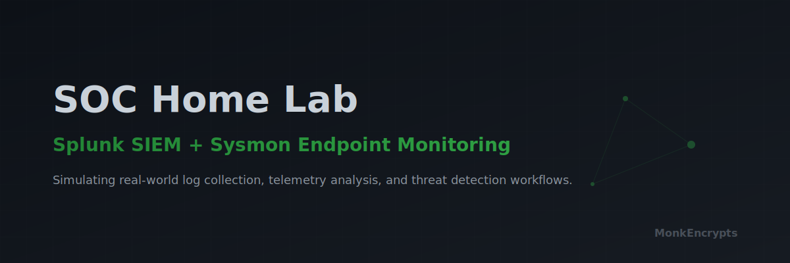

<p align="center">
  
</p>
# SOC Home Lab — Splunk SIEM + Sysmon Endpoint Monitoring

> A hands-on Security Operations Center home lab simulating real-world log collection, telemetry analysis, and threat detection workflows.

---

## Table of Contents

- [Project Overview](#project-overview)
- [Objectives](#objectives)
- [Lab Architecture](#lab-architecture)
- [Technologies Used](#technologies-used)
- [Repository Structure](#repository-structure)
- [Quick Start — Documentation Index](#quick-start--documentation-index)
- [Key Outcomes](#key-outcomes)
- [Detection Use Cases](#detection-use-cases)
- [Future Improvements](#future-improvements)
- [Author](#author)

---

## Project Overview

This project documents the design, deployment, and configuration of a functional SOC (Security Operations Center) home lab built on consumer hardware. The lab simulates an enterprise security monitoring environment consisting of a centralized SIEM platform, an instrumented Windows endpoint, and a Kali Linux attacker machine — all interconnected through an isolated virtual network.

The primary objective of this project is to demonstrate practical SOC skills including SIEM deployment, endpoint telemetry collection, log pipeline engineering, and the foundational detection workflow expected of a Tier 1 SOC Analyst.

---

## Objectives

- Deploy and configure Splunk Enterprise as a functional SIEM platform
- Instrument a Windows 10 endpoint with Sysmon using a community-maintained detection baseline
- Configure the Splunk Universal Forwarder to ship Sysmon telemetry to the SIEM over TCP
- Validate end-to-end log ingestion and confirm event visibility within Splunk
- Architect an isolated virtual network separating attack traffic from internet-facing activity
- Build a structured GitHub portfolio demonstrating SOC-relevant skills to cybersecurity employers

---

## Lab Architecture

```
                        Windows 11 Host Machine
                        ┌─────────────────────────────────────┐
                        │  Splunk Enterprise (SIEM)           │
                        │  IP: 192.168.13.1 (Host-Only)       │
                        │  Receiving Port: TCP 9997           │
                        └──────────────┬──────────────────────┘
                                       │
                           VMnet1 — Host-Only Network
                           192.168.13.0/24
                     ┌─────────────────────────────────┐
                     │                                 │
        ┌────────────┴────────────┐     ┌──────────────┴────────────┐
        │  Windows 10 Endpoint   │     │  Kali Linux Attacker      │
        │  IP: 192.168.13.128    │     │  IP: 192.168.13.129       │
        │  Sysmon + UF Installed │     │  Attack Simulation        │
        └────────────────────────┘     └───────────────────────────┘

        Both VMs also connected to VMnet8 (NAT) for internet access
```

**Log Flow:**
```
Windows 10 Endpoint
  └─ Sysmon generates telemetry (Event IDs: 1, 3, 5, 7, 11, 12, 13, 15, 22...)
      └─ Splunk Universal Forwarder reads Microsoft-Windows-Sysmon/Operational
          └─ Forwards via TCP 9997 → Splunk Enterprise SIEM
              └─ Events indexed and available for search, alerting, and investigation
```

---

## Technologies Used

| Component | Technology | Version / Notes |
|---|---|---|
| SIEM Platform | Splunk Enterprise | Free developer license |
| Endpoint Monitoring | Sysmon (System Monitor) | Microsoft Sysinternals |
| Sysmon Config | SwiftOnSecurity Baseline | Community-maintained detection baseline |
| Log Shipping Agent | Splunk Universal Forwarder | Installed on Windows 10 VM |
| Hypervisor | VMware Workstation Pro | Host-Only + NAT networking |
| Attacker Machine | Kali Linux | VM on VMware Workstation |
| Windows Endpoint | Windows 10 Pro | VM on VMware Workstation |
| SIEM Host OS | Windows 11 | Physical host machine |
| Network Type | VMware Host-Only (VMnet1) | Isolated internal network |

---

## Repository Structure

```
SOC-Home-Lab/
│
├── README.md                          ← You are here
│
├── docs/
│   ├── 01-project-overview/
│   │   └── hardware-assessment.md     ← Hardware specs and architecture decisions
│   │
│   ├── 02-architecture/
│   │   ├── network-architecture.md    ← Final network design and IP allocation
│   │   ├── network-segmentation.md    ← VMnet1 vs VMnet8 design rationale
│   │   ├── architecture-decisions.md  ← Why the architecture changed
│   │   └── screenshots/
│   │
│   ├── 03-environment-setup/
│   │   ├── vmware-installation.md     ← VMware Workstation Pro installation
│   │   └── screenshots/
│   │
│   ├── 04-splunk-siem/
│   │   ├── splunk-installation.md     ← Splunk Enterprise setup
│   │   ├── splunk-receiver-config.md  ← Receiver port configuration
│   │   └── screenshots/
│   │
│   ├── 05-windows-endpoint/
│   │   ├── windows-installation.md    ← Windows 10 VM setup
│   │   └── screenshots/
│   │
│   ├── 06-sysmon/
│   │   ├── sysmon-installation.md     ← Sysmon deployment and config
│   │   ├── sysmon-verification.md     ← Event Viewer telemetry verification
│   │   └── screenshots/
│   │
│   ├── 07-log-forwarding/
│   │   ├── uf-installation.md         ← Universal Forwarder deployment
│   │   ├── inputs-conf-config.md      ← inputs.conf explained
│   │   └── screenshots/
│   │
│   ├── 08-log-verification/
│   │   ├── splunk-search-validation.md ← Confirming events reach Splunk
│   │   └── screenshots/
│   │
│   ├── 09-detection-usecases/
│   │   └── detection-use-cases.md     ← MITRE ATT&CK mapped detections
│   │
│   ├── 10-incident-response/
│   │   └── ir-playbook-template.md    ← IR workflow placeholder
│   │
│   ├── 11-troubleshooting/
│   │   └── troubleshooting-log.md     ← All issues encountered and resolved
│   │
│   ├── 12-lessons-learned/
│   │   └── lessons-learned.md         ← Reflections and takeaways
│   │
│   └── 13-future-improvements/
│       └── roadmap.md                 ← Planned enhancements
│
├── configs/
│   ├── inputs.conf                    ← Splunk UF inputs configuration
│   └── sysmon-config-reference.md     ← Sysmon config key rules explained
│
└── diagrams/
    └── network-diagram.md             ← ASCII and Mermaid network diagrams
```

---

## Quick Start — Documentation Index

| Step | Document | Description |
|---|---|---|
| 1 | [Hardware Assessment](docs/01-project-overview/hardware-assessment.md) | Physical machines used and architecture selection |
| 2 | [Architecture Overview](docs/02-architecture/network-architecture.md) | Network design, IP plan, and log flow |
| 3 | [VMware Setup](docs/03-environment-setup/vmware-installation.md) | Hypervisor installation and VM provisioning |
| 4 | [Splunk SIEM](docs/04-splunk-siem/splunk-installation.md) | Splunk Enterprise deployment and receiver config |
| 5 | [Windows Endpoint](docs/05-windows-endpoint/windows-installation.md) | Windows 10 VM setup and VMware Tools |
| 6 | [Sysmon](docs/06-sysmon/sysmon-installation.md) | Sysmon deployment with SwiftOnSecurity config |
| 7 | [Log Forwarding](docs/07-log-forwarding/uf-installation.md) | Universal Forwarder installation and inputs.conf |
| 8 | [Log Verification](docs/08-log-verification/splunk-search-validation.md) | Confirming events appear in Splunk |
| 9 | [Troubleshooting](docs/11-troubleshooting/troubleshooting-log.md) | Every issue encountered and how it was resolved |
| 10 | [Lessons Learned](docs/12-lessons-learned/lessons-learned.md) | Key technical and professional takeaways |

---

## Key Outcomes

- ✅ Splunk Enterprise deployed and accessible at `http://localhost:8000`
- ✅ Receiver configured on TCP port 9997 and verified with `Test-NetConnection`
- ✅ Windows 10 endpoint instrumented with Sysmon (SwiftOnSecurity baseline)
- ✅ Sysmon telemetry generation verified in both Windows Event Viewer and Splunk Enterprise, confirming successful end-to-end endpoint telemetry collection.
- ✅ Splunk Universal Forwarder installed and connected to SIEM
- ✅ `inputs.conf` configured to forward `Microsoft-Windows-Sysmon/Operational` channel
- ✅ Sysmon Event ID 1 (Process Creation) events confirmed in Splunk search
- ✅ Isolated Host-Only network verified with bidirectional connectivity
- ✅ Dual-adapter design separates attack traffic from internet access

---

## Detection Use Cases

Detection engineering content is in active development. Planned coverage includes:

| ATT&CK Technique                       | Tactic              | Sysmon Event ID | Status      |
| -------------------------------------- | ------------------- | --------------- | ----------- |
| T1059.001 — PowerShell Execution       | Execution           | Event ID 1      | ✅ Validated |
| T1003.001 — LSASS Memory Dump          | Credential Access   | Event ID 10     | 📋 Planned  |
| T1071.001 — HTTP C2 Beaconing          | Command and Control | Event ID 3      | 📋 Planned  |
| T1547.001 — Registry Run Keys          | Persistence         | Event ID 12/13  | 📋 Planned  |
| T1543.003 — Malicious Service Creation | Persistence         | Event ID 1      | 📋 Planned  |

---

## Future Improvements

- Add Kali Linux attack simulations with documented detection results
- Create Splunk alerts and correlation searches for each use case
- Integrate Elastic Stack as an alternative SIEM for comparison
- Add a third VM (Ubuntu Server) as a secondary monitored endpoint
- Build a network IDS layer using Suricata or Zeek
- Document a complete incident response workflow from alert to closure

---

## Author

Built as a hands-on cybersecurity portfolio project to demonstrate SOC Analyst skills including SIEM deployment, endpoint telemetry engineering, log pipeline configuration, and threat detection foundations.

> *This lab was constructed entirely on consumer hardware using free and community-supported tooling, demonstrating practical security operations skills without enterprise resources.*
