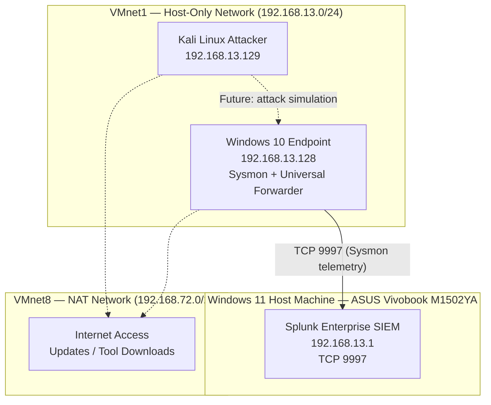
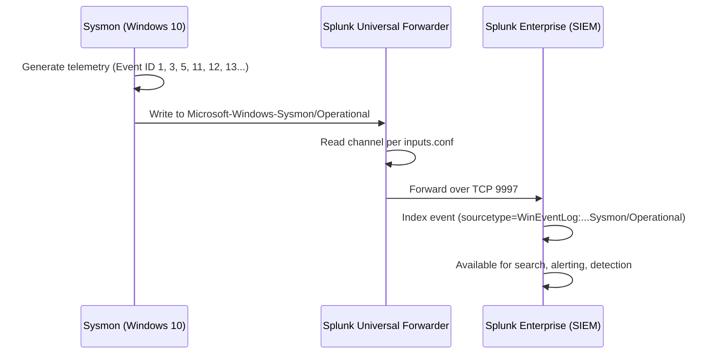

# Network Diagram

## ASCII Reference Diagram

```
                          ┌──────────────────────────────────────┐
                          │         Windows 11 Host Machine      │
                          │         ASUS Vivobook M1502YA        │
                          │                                      │
                          │  ┌────────────────────────────────┐  │
                          │  │   Splunk Enterprise (SIEM)     │  │
                          │  │   Listening on TCP 9997        │  │
                          │  └───────────────┬────────────────┘  │
                          └──────────────────┼───────────────────┘
                                             │
                              ───────────────────────────────
                              VMnet1 — VMware Host-Only Network
                                    192.168.13.0/24
                                    Gateway: 192.168.13.1
                              ───────────────────────────────
                                             │
                      ┌──────────────────────┴──────────────────────┐
                      │                                             │
          ┌───────────┴──────────────┐              ┌──────────────┴────────────┐
          │   Windows 10 Endpoint   │              │   Kali Linux Attacker     │
          │   192.168.13.128/24     │              │   192.168.13.129/24       │
          │                         │              │                            │
          │   Sysmon + UF running   │              │   Attack tools / Kali     │
          └───────────┬─────────────┘              └──────────────┬────────────┘
                      │                                           │
                      └───────────────── VMnet8 ─────────────────┘
                                   VMware NAT Network
                                    192.168.72.0/24
                                         │
                                    Internet Access
                              (Updates, tool downloads)
```

## Mermaid Source

The following Mermaid diagram source renders the same architecture and can be pasted into any Mermaid-compatible renderer (GitHub natively renders Mermaid in `.md` files):



## Log Flow Diagram


