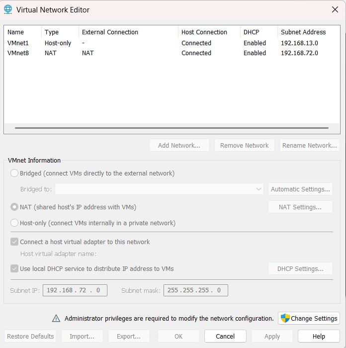

# Network Architecture

## Overview

The SOC home lab uses a dual-network virtual architecture designed to separate security monitoring traffic from internet-facing activity. All components communicate through VMware virtual networks managed by VMware Workstation Pro on the Windows 11 host.

---

## Network Diagram

```
                          ┌──────────────────────────────────────┐
                          │         Windows 11 Host Machine      │
                          │         ASUS Vivobook M1502YA        │
                          │                                      │
                          │  ┌────────────────────────────────┐  │
                          │  │   Splunk Enterprise (SIEM)     │  │
                          │  │   Listening on TCP 9997        │  │
                          │  └───────────────┬────────────────┘  │
                          └──────────────────┼───────────────────┘
                                             │
                              ───────────────────────────────
                              VMnet1 — VMware Host-Only Network
                                    192.168.13.0/24
                                    Gateway: 192.168.13.1
                              ───────────────────────────────
                                             │
                      ┌──────────────────────┴──────────────────────┐
                      │                                             │
          ┌───────────┴──────────────┐              ┌──────────────┴────────────┐
          │   Windows 10 Endpoint   │              │   Kali Linux Attacker     │
          │   192.168.13.128/24     │              │   192.168.13.129/24       │
          │                         │              │                            │
          │   Sysmon + UF running   │              │   Attack tools / Kali     │
          └───────────┬─────────────┘              └──────────────┬────────────┘
                      │                                           │
                      └───────────────── VMnet8 ─────────────────┘
                                   VMware NAT Network
                                    192.168.72.0/24
                                         │
                                    Internet Access
                              (Updates, tool downloads)
```

---

## IP Address Allocation

| Device | Interface | Network | IP Address | Purpose |
|---|---|---|---|---|
| Windows 11 Host (Splunk) | VMnet1 adapter | Host-Only | 192.168.13.1 | SIEM receiver |
| Windows 10 Endpoint VM | Ethernet0 (Host-Only) | VMnet1 | 192.168.13.128 | Log source |
| Windows 10 Endpoint VM | Ethernet1 (NAT) | VMnet8 | DHCP assigned | Internet access |
| Kali Linux Attacker VM | eth0 (Host-Only) | VMnet1 | 192.168.13.129 | Attack simulation |
| Kali Linux Attacker VM | eth1 (NAT) | VMnet8 | DHCP assigned | Internet access |

---

## Log Forwarding Channel

```
Windows 10 Endpoint (192.168.13.128)
    └── Splunk Universal Forwarder
        └── TCP port 9997 ──────────────────────→ Splunk Enterprise (192.168.13.1:9997)
```

Connectivity was verified using PowerShell from the Windows 10 endpoint:

```powershell
Test-NetConnection 192.168.13.1 -Port 9997
```

Expected output:
```
TcpTestSucceeded : True
```

---

## Network Segmentation Design

### VMware Virtual Network Configuration



The SOC lab uses two VMware virtual networks:

- **VMnet1 (Host-Only):** Isolated internal network used for communication between the Windows endpoint, Kali Linux attacker, and the Splunk host.
- **VMnet8 (NAT):** Provides internet connectivity for software installation and updates while keeping attack traffic isolated from external networks.

---
### VMnet1 — Host-Only Network (Attack and Monitoring Traffic)

This network carries all security-relevant traffic between the virtual machines and the SIEM host. It is completely isolated from the external internet, ensuring that attack simulations do not generate real-world network activity.

Components on this network:
- Splunk Enterprise (receiving end)
- Windows 10 Endpoint (log source and victim)
- Kali Linux Attacker (attack origination)

### VMnet8 — NAT Network (Internet Access)

This network provides internet connectivity for software updates, tool downloads, and remote resource access. Attack simulation traffic is never intended to transit this interface, maintaining a clean separation between lab operations and external connectivity.

---

## Firewall Configuration Changes

Two firewall exceptions were required to establish full connectivity within the lab:

### 1. ICMPv4 Echo Request — Windows 10 Endpoint (Public Profile)

The VMware Host-Only adapter on the Windows 10 VM was classified by Windows as an **Unidentified Public Network**. The default ICMP rules only applied to Domain and Private profiles, causing inbound ping requests from the Splunk host to be silently dropped.

A custom inbound firewall rule was created:

| Parameter | Value |
|---|---|
| Rule Type | Custom |
| Protocol | ICMPv4 |
| ICMP Type | Echo Request |
| Action | Allow |
| Profile | Public |

### 2. TCP Port 9997 — Windows 11 Splunk Host

Splunk was confirmed listening on TCP 9997 via `netstat`, but Windows Defender Firewall blocked inbound connections from the virtual network. A port-based inbound rule was created:

| Parameter | Value |
|---|---|
| Rule Type | Port |
| Protocol | TCP |
| Local Port | 9997 |
| Action | Allow |
| Profiles | Domain, Private, Public |

After applying both rules, bidirectional ICMP connectivity and full TCP 9997 forwarding were confirmed.
