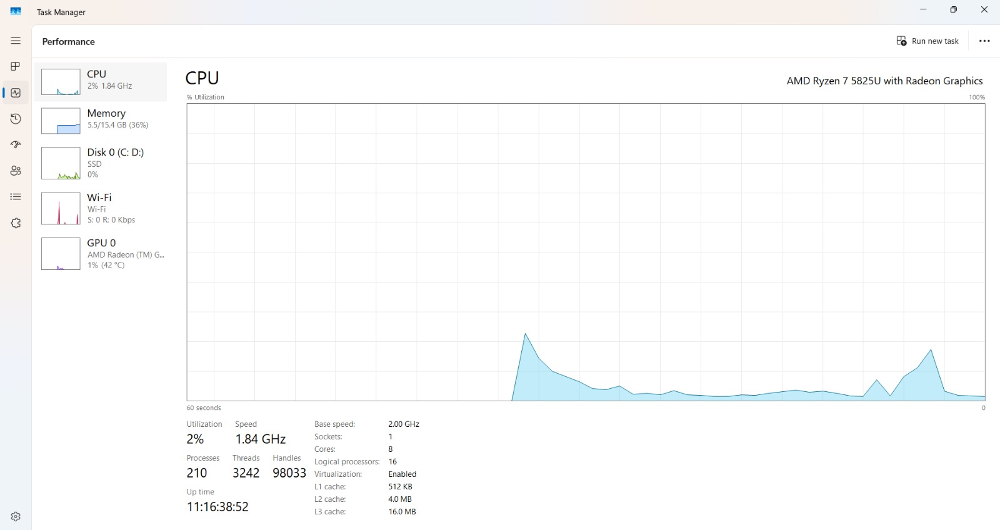
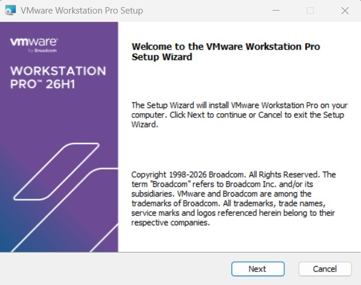
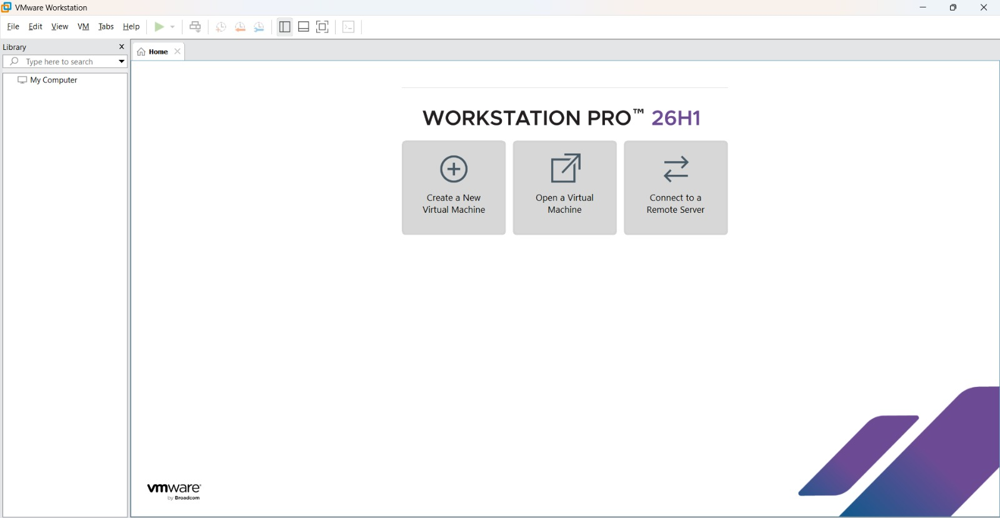
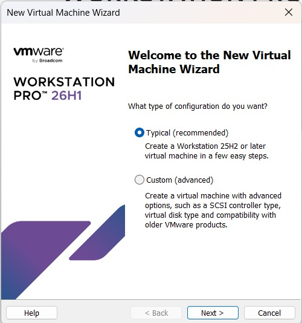
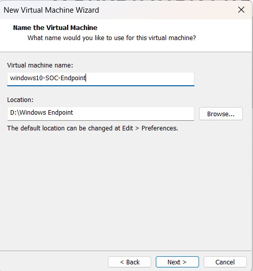
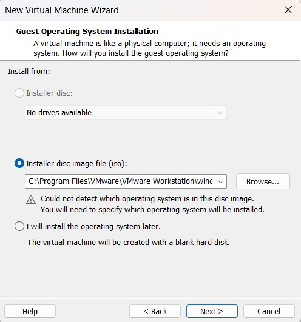
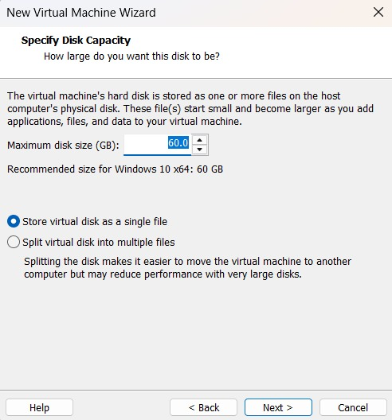
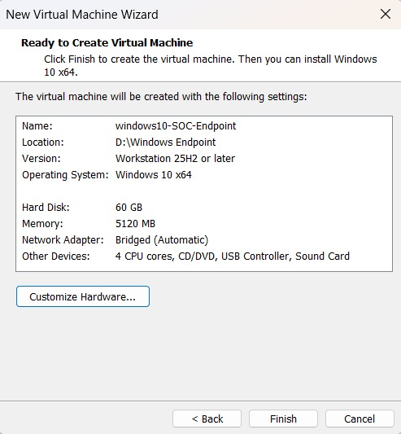
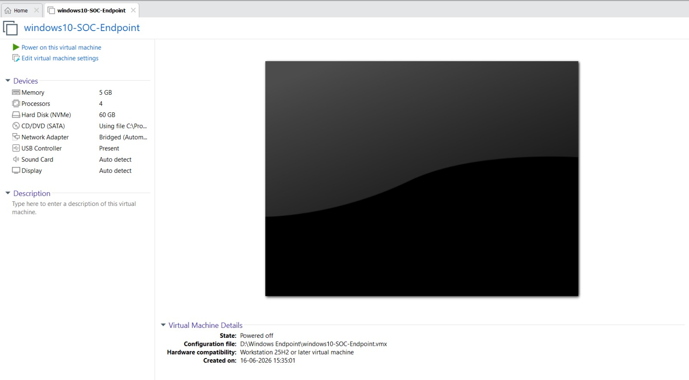
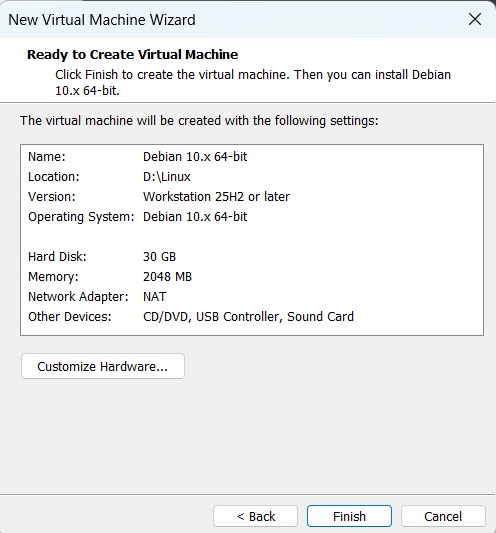

# Environment Setup — VMware Workstation Installation and VM Provisioning

## Objective

Install VMware Workstation Pro as the hypervisor for the lab and provision the virtual machines that make up the SOC environment: the Windows 10 monitored endpoint and the Kali Linux attacker.

---

## Step 1 — Enable Hardware Virtualization

Before installing any hypervisor, hardware-assisted virtualization (Intel VT-x / AMD-V) must be enabled in the system BIOS/UEFI. Without this, VMware Workstation will fail to run 64-bit guest operating systems at usable performance.

*Figure 1 — Hardware virtualization confirmed enabled in BIOS/UEFI settings, a prerequisite for running 64-bit virtual machines in VMware Workstation.*

---

## Step 2 — Install VMware Workstation Pro

VMware Workstation Pro was selected as the hypervisor for this lab due to its mature snapshot management, virtual networking options (Host-Only, NAT, Bridged), and broad compatibility with Windows and Linux guest operating systems.

Installation steps performed:

1. Downloaded the VMware Workstation Pro installer.
2. Ran the installer with administrator privileges.
3. Enabled the Enhanced Keyboard Driver (improves keyboard input fidelity inside guest VMs).
4. Disabled the Customer Experience Improvement Program (CEIP) to avoid sending telemetry to VMware/Broadcom.
5. Completed installation and verified successful application launch.

*Figure 2 — VMware Workstation Pro 26H1 setup wizard.*

*Figure 3 — VMware Workstation Pro launched successfully, confirming a working hypervisor installation.*

---

## Step 3 — Provision the Windows 10 Endpoint VM

The Windows 10 VM serves as the monitored endpoint in this lab — the system that will run Sysmon and the Splunk Universal Forwarder, and the system against which attack simulations will eventually be run.

*Figure 4 — VMware's New Virtual Machine Wizard. The "Typical" configuration path was used to streamline VM creation with sensible defaults.*

*Figure 5 — Naming the VM and selecting its storage location on the host's NVMe SSD for low-latency disk I/O.*

*Figure 6 — Windows 10 installation ISO selected as the boot source for the new virtual machine.*

*Figure 7 — Virtual disk size and provisioning type configured for the Windows 10 endpoint.*

*Figure 8 — Final hardware configuration summary before VM creation, showing allocated RAM, CPU cores, and disk size.*

*Figure 9 — Windows 10 endpoint VM successfully created and listed in the VMware Workstation library, ready for OS installation.*

---

## Step 4 — Provision the Kali Linux Attacker VM

The Kali Linux VM serves as the attack simulation platform for this lab. It is provisioned on the same host using the same Host-Only virtual network as the Windows 10 endpoint, ensuring both systems can communicate for future attack-and-detect exercises.

*Figure 10 — New Virtual Machine Wizard used to provision the Kali Linux attacker VM.*

> **Note:** Detailed Kali Linux configuration (tool installation, attack scripting, and simulation results) is documented separately in [Detection Use Cases](../09-detection-usecases/detection-use-cases.md) as that work is completed.

---

## Verification

- VMware Workstation Pro launches without error and displays both VMs in the library.
- Both VMs boot successfully from their respective installation media.
- Both VMs are visible under **Edit → Virtual Network Editor** as attached to VMnet1 (Host-Only) and VMnet8 (NAT).
