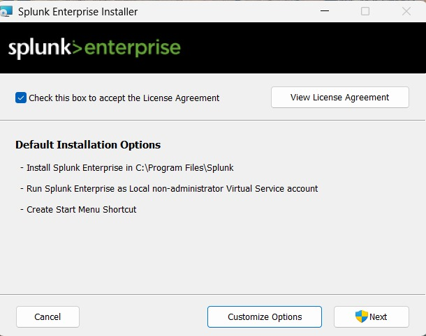
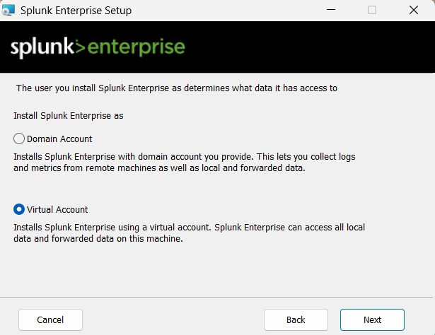
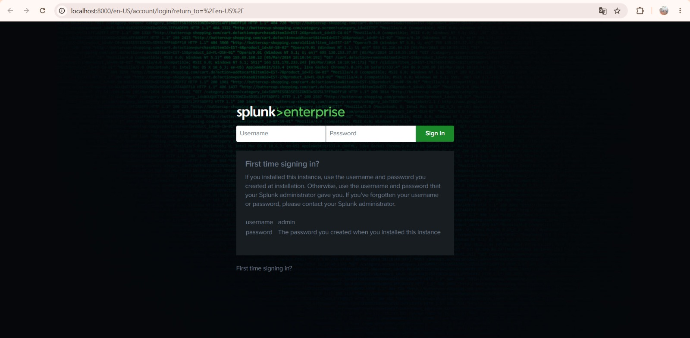
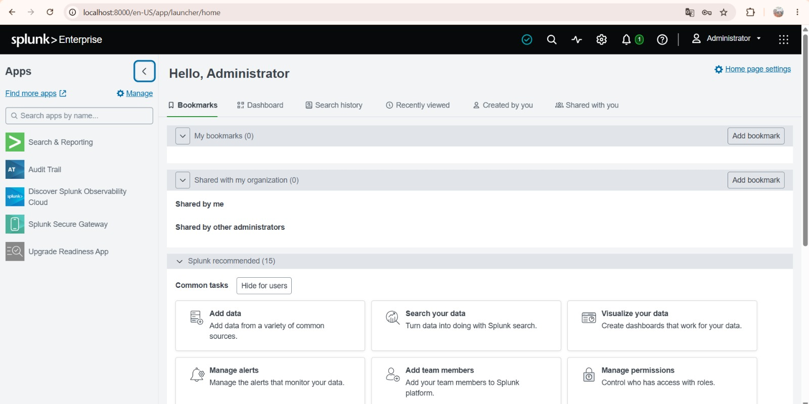

# Splunk Enterprise — SIEM Installation and Setup

## Objective

Deploy Splunk Enterprise as the central SIEM (Security Information and Event Management) platform for the lab. Splunk will receive, index, and make searchable all telemetry forwarded from the Windows 10 endpoint.

## Why Splunk Enterprise

Splunk is one of the most widely deployed SIEM platforms in enterprise SOC environments, making it a high-value tool to demonstrate hands-on familiarity with for SOC Analyst roles. The free Splunk Enterprise license (500 MB/day indexing limit) is sufficient for a home lab of this scale and provides the full search, dashboarding, and alerting feature set used in production deployments.

---

## Installation

Splunk Enterprise was installed directly on the Windows 11 host operating system rather than inside a virtual machine, in order to dedicate the VM resources to the endpoint and attacker systems (see [Hardware Assessment](../01-project-overview/hardware-assessment.md) for the resource allocation rationale).

### Installation Steps

1. Downloaded the Splunk Enterprise Windows installer from splunk.com.
2. Accepted the license agreement.
3. Reviewed the default installation options (install path `C:\Program Files\Splunk`, Splunk running as a local non-administrator virtual service account, and Start Menu shortcut creation).
4. Completed the installation using the default options, which follow Splunk's recommended security posture of running as a low-privilege service account rather than a full administrator.


*Figure 1 — Splunk Enterprise installer showing the default installation path and the recommendation to run Splunk under a non-administrator virtual service account, reducing the impact of a potential Splunk-process compromise.*


*Figure 2 — Creating the initial Splunk administrator account during first-run setup.*

---

## Verification — Splunk Web Access

After installation, the Splunk Web interface was accessed at the default management port to confirm the service was running correctly:

```
http://localhost:8000
```


*Figure 3 — Splunk Web login page, confirming the Splunk service started successfully and is listening on port 8000.*


*Figure 4 — Successful authentication into the Splunk Enterprise dashboard, confirming the SIEM platform is fully operational on the Windows 11 host.*

---

## Next Step

With Splunk Enterprise operational, the next configuration step is enabling a receiving port so the platform can accept forwarded telemetry from remote agents. This is covered in [Splunk Receiver Configuration](splunk-receiver-config.md).
