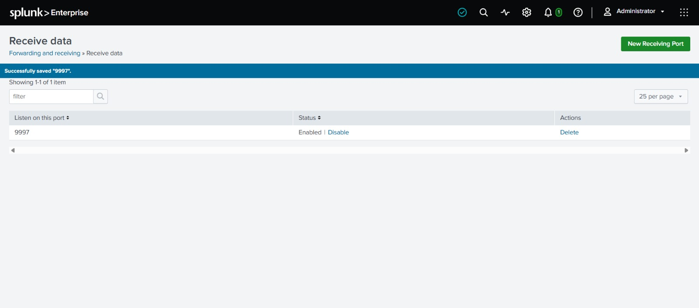
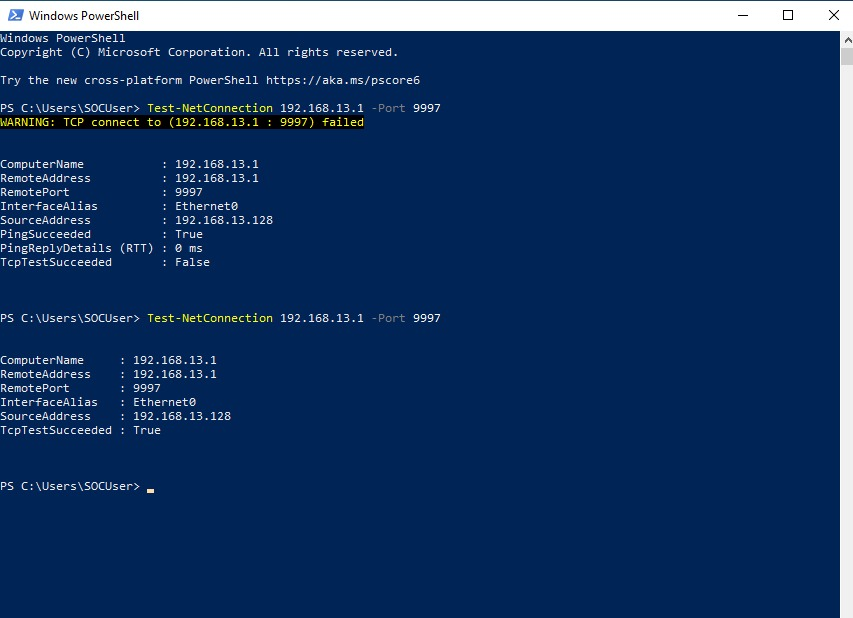

# Splunk Receiver Configuration

## Objective

Configure Splunk Enterprise to accept (receive) telemetry forwarded by Splunk Universal Forwarders running on remote — or in this case, network-isolated virtual — endpoints.

## Why a Receiving Port Is Required

By default, a fresh Splunk Enterprise installation only indexes data fed to it locally; it does not listen for incoming forwarder connections. To act as a centralized SIEM, Splunk must be explicitly configured with a receiving port that forwarders can connect to. The Splunk-standard port for this purpose is **TCP 9997**.

---

## Configuration Steps

1. Navigated to **Settings → Forwarding and Receiving → Configure Receiving**.
2. Created a new receiving port and set it to **9997** (Splunk's conventional forwarder-to-indexer port).
3. Saved the configuration and confirmed the port showed an **Enabled** status.

| Parameter | Value |
|---|---|
| Splunk Host | Windows 11 (192.168.13.1 on VMnet1) |
| Receiving Port | TCP 9997 |
| Status | Enabled |


*Figure 1 — Splunk's "Receive data" configuration page confirming TCP port 9997 is enabled and listening for forwarder connections.*

---

## Connectivity Verification

After enabling the receiver, connectivity from the Windows 10 endpoint to the Splunk host was tested using PowerShell's `Test-NetConnection` cmdlet:

```powershell
Test-NetConnection 192.168.13.1 -Port 9997
```

### Initial Result — Failed

The first connectivity test failed despite Splunk actively listening on the port:

```
WARNING: TCP connect to (192.168.13.1 : 9997) failed
PingSucceeded    : True
TcpTestSucceeded : False
```

ICMP (ping) succeeded, confirming basic network reachability, but the TCP handshake on port 9997 failed — pointing to a firewall rule blocking the specific port rather than a routing or connectivity problem. Root-cause investigation and the firewall fix are documented in detail in [Network Troubleshooting](../11-troubleshooting/troubleshooting-log.md#issue-4--splunk-receiving-port-reachable-locally-but-not-from-the-endpoint).

### Final Result — Success

After creating an inbound Windows Defender Firewall rule allowing TCP port 9997 across all network profiles, the test was repeated:

```
TcpTestSucceeded : True
```


*Figure 2 — PowerShell output showing the initial failed TCP test (`TcpTestSucceeded : False`) followed by a successful retest (`TcpTestSucceeded : True`) after the Windows Defender Firewall rule for TCP 9997 was added on the Splunk host.*

This confirmed that the Splunk Enterprise receiver was correctly configured and reachable from the Windows 10 endpoint, clearing the way to install and configure the Universal Forwarder. See [Universal Forwarder Installation](../07-log-forwarding/uf-installation.md).
