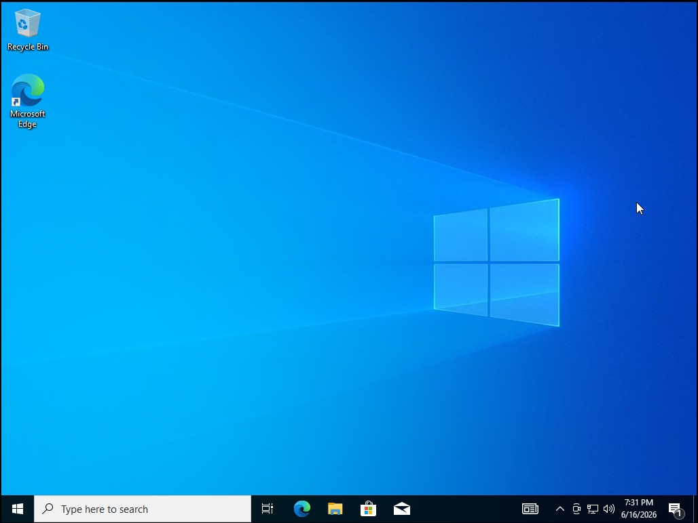
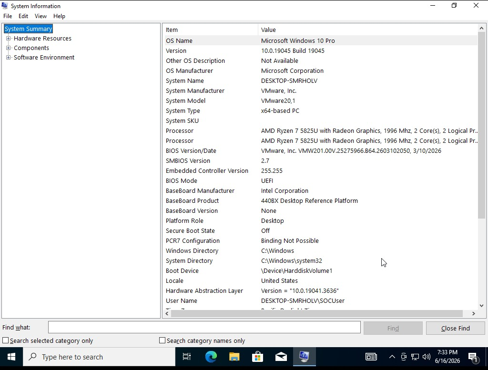
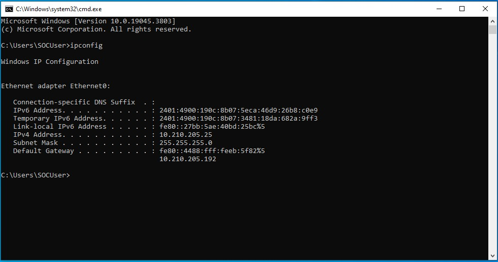
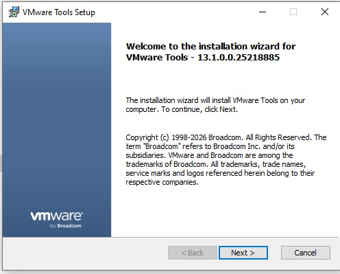
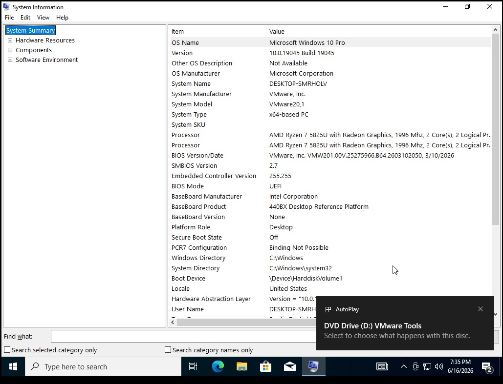
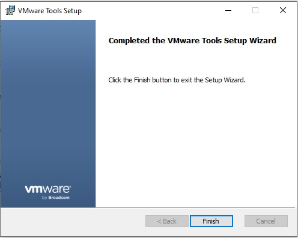

# Windows Endpoint — VM Installation and Configuration

## Objective

Provision a Windows 10 virtual machine to serve as the monitored endpoint for this SOC lab. This system generates the Windows Event Log and Sysmon telemetry that the rest of the pipeline depends on, and is the intended target for future attack simulations from the Kali Linux VM.

## Role in the SOC Architecture

| Function | Description |
|---|---|
| Telemetry source | Generates native Windows Event Logs and Sysmon telemetry |
| Forwarding agent host | Runs the Splunk Universal Forwarder |
| Attack target | Future target for Kali Linux attack simulations |

---

## Installation Walkthrough

The Windows 10 VM was installed from an official Windows 10 Pro ISO using VMware Workstation Pro's guided installation. The installation followed a standard clean-install path: language/region/keyboard selection, **Windows 10 Pro** edition selection, **Custom: Install Windows only** (rather than an in-place upgrade) targeting the VM's virtual disk, and a local user account rather than a Microsoft account — keeping the lab fully self-contained and able to run without internet access if needed.

*Figure 1 — Fresh Windows 10 desktop confirming a successful, clean installation prior to any monitoring agent deployment.*

---

## Troubleshooting Encountered

During initial boot, the VM failed to load the Windows installation media. Investigation showed that the VMware virtual CD/DVD device was pointed at an incorrect ISO path in the VM's settings. Correcting the ISO path in **VM Settings → CD/DVD (SATA)** resolved the issue, and the VM successfully booted from the installation media on the next attempt.

---

## System Verification

Post-installation, the system configuration was verified using **System Information** (`msinfo32`):

| Property | Value |
|---|---|
| OS Name | Microsoft Windows 10 Pro |
| OS Build | 10.0.19045 |
| System Manufacturer | VMware, Inc. |
| System Model | VMware20,1 |
| BIOS Mode | UEFI |
| Hostname | DESKTOP-SMRHOLV |

*Figure 2 — System Information panel confirming the VM is running Windows 10 Pro on virtualized VMware hardware.*

> **Note on the IP configuration screenshot below:** this `ipconfig` output was captured during the **original multi-host architecture phase**, while the endpoint was still connected via VMware Bridged networking on the mobile-hotspot network (`10.210.205.0/24`). It is retained here as a historical record of that phase. The endpoint's IP address in the **final, current architecture** is `192.168.13.128` on the VMware Host-Only network (VMnet1) — see [Network Architecture](../02-architecture/network-architecture.md) for the authoritative current configuration.

*Figure 3 — `ipconfig` output from the original bridged-network architecture phase, prior to the migration to VMware Host-Only networking.*

---

## VMware Tools Installation

VMware Tools was installed inside the Windows 10 guest to improve display performance, enable clipboard sharing, and provide more accurate guest OS performance metrics to the hypervisor.

*Figure 4 — VMware Tools installer executable (`setup64.exe`) launched from the mounted VMware Tools virtual CD.*

*Figure 5 — VMware Tools installation wizard with default component selection.*

*Figure 6 — VMware Tools installation completed successfully.*

---

## Next Step

With the Windows 10 endpoint installed and verified, the next step is deploying Sysmon to generate detailed security telemetry. See [Sysmon Installation](../06-sysmon/sysmon-installation.md).
