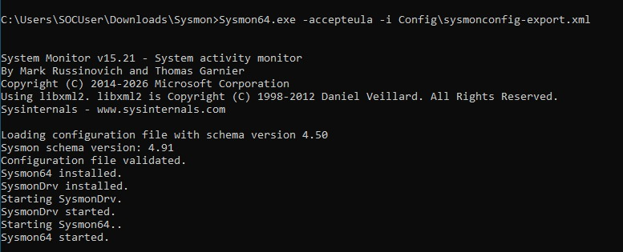

# Sysmon Installation and Configuration

## Objective

Deploy Sysmon (System Monitor) on the Windows 10 endpoint to provide enhanced, security-relevant telemetry well beyond what default Windows Event Logging captures. Sysmon's output is the foundation of the entire detection pipeline in this lab — it is the data source that the Universal Forwarder ships to Splunk, and the data source that any future detection logic will query against.

## Why Sysmon

Native Windows auditing logs basic events (logon/logoff, some object access) but lacks the process-level and network-level visibility that real-world threat detection depends on. Sysmon, a free Microsoft Sysinternals tool, fills this gap by logging:

- Process creation, including full command-line arguments and parent/child relationships
- Network connections initiated by processes
- File creation and modification timestamps (timestomping detection)
- Registry modifications
- DNS query activity
- Image/driver loading events

This makes Sysmon one of the most widely used free EDR-adjacent tools in SOC environments, and hands-on Sysmon configuration experience is directly relevant to real detection engineering work.

---

## Configuration Selection — SwiftOnSecurity Baseline

The default, out-of-the-box Sysmon configuration (i.e., running Sysmon with no `-c` config file) logs only a minimal set of events and is not suitable for security monitoring — it generates too little signal to support real detections.

Instead, this lab uses the **SwiftOnSecurity Sysmon configuration**, a widely adopted, community-maintained XML configuration that is tuned to:

- Capture high-value security events (process creation, network connections, registry persistence, DNS queries)
- Filter out high-volume, low-value noise (e.g., routine system process activity) that would otherwise overwhelm the SIEM's indexing capacity
- Reflect detection priorities commonly seen in real SOC environments

The configuration file `sysmonconfig-export.xml` was downloaded from the SwiftOnSecurity GitHub repository prior to installation.

---

## Installation

Sysmon was installed via an elevated Command Prompt using the downloaded SwiftOnSecurity configuration:

```cmd
Sysmon64.exe -accepteula -i Config\sysmonconfig-export.xml
```

| Flag | Purpose |
|---|---|
| `-accepteula` | Silently accepts the Sysinternals End User License Agreement, required for unattended/scripted installs |
| `-i <path>` | Installs Sysmon as a service and applies the specified XML configuration |


*Figure 1 — Sysmon64.exe installation output. The tool reports Sysmon schema version 4.91, validates the SwiftOnSecurity configuration file, installs the SysmonDrv kernel driver, and starts both the driver and the Sysmon64 service successfully.*

> **Repository note:** the install command was executed from `C:\Users\SOCUser\Downloads\Sysmon`, as shown in the command prompt path above. This differs from the originally planned directory structure (`C:\SecurityTools\Sysmon\`) documented in early planning notes. Functionally this has no impact — Sysmon installs as a Windows service regardless of the directory it is launched from — but it is noted here for documentation accuracy. A future iteration of this lab will standardize on the `C:\SecurityTools\` convention for all security tooling to keep the endpoint's file layout consistent and easy to audit.

---

## Verification

Installation success was confirmed directly in the command output, which reported:

- The SwiftOnSecurity configuration file was loaded and validated against Sysmon schema version 4.91.
- `Sysmon64` was installed.
- The `SysmonDrv` kernel driver was installed and started.
- The `Sysmon64` service started successfully.

Detailed telemetry verification — confirming that Sysmon is actively generating and logging security-relevant events — is documented in [Sysmon Verification](sysmon-verification.md).
