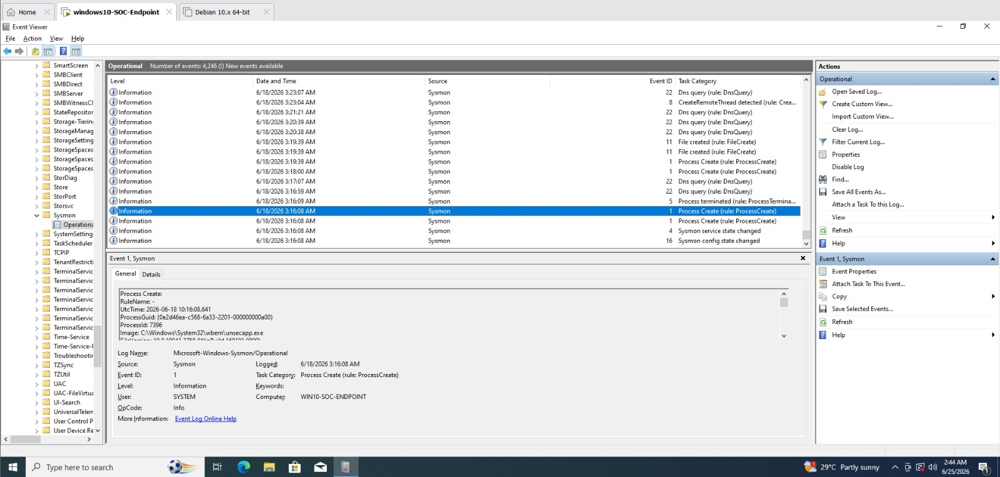

# Sysmon Verification

## Objective

Confirm that Sysmon is generating endpoint telemetry as expected following installation, and validate that the SwiftOnSecurity configuration is actively shaping which events are logged.

## Verification Method

Sysmon's output was inspected directly in Windows Event Viewer, under the dedicated Sysmon Operational log channel:

```
Event Viewer → Applications and Services Logs → Microsoft → Windows → Sysmon → Operational
```

This is the same log channel — `Microsoft-Windows-Sysmon/Operational` — that the Splunk Universal Forwarder is later configured to monitor and ship to the SIEM (see [inputs.conf Configuration](../07-log-forwarding/inputs-conf-config.md)), so confirming events appear here is the correct checkpoint before moving on to log forwarding.

---

## Observed Events

The following Sysmon event types were observed in the Operational log, confirming both correct installation and correct application of the SwiftOnSecurity configuration:

### Screenshot Reference



The Event Viewer confirms that Sysmon is actively generating endpoint telemetry. Event IDs 1 (Process Creation), 4 (Service State Changed), 5 (Process Termination), and 16 (Configuration Change) were observed in the `Microsoft-Windows-Sysmon/Operational` log, confirming successful deployment and configuration.

### Event ID 16 — Sysmon Configuration Change

Confirms that the SwiftOnSecurity configuration file was successfully loaded by the Sysmon service. This event fires once at service start (or whenever the configuration is reloaded) and includes a hash of the active configuration, which is useful for confirming configuration integrity over time.

### Event ID 4 — Sysmon Service State Changed

Confirms that the Sysmon service and its kernel driver (`SysmonDrv`) initialized successfully and are actively running.

### Event ID 1 — Process Creation

Confirms that Sysmon is capturing detailed process execution telemetry, including:
- Full process image path
- Command-line arguments
- Parent process and parent command line
- User context (account that launched the process)
- File hashes (SHA256 by default in the SwiftOnSecurity config)

This is the single most valuable event ID for detection engineering — the majority of endpoint detections (suspicious LOLBins, encoded PowerShell, unusual parent/child process chains) are built on Event ID 1 data.

### Event ID 5 — Process Termination

Confirms Sysmon is also tracking when monitored processes exit, which supports building a complete process lifecycle timeline during an investigation.

---
## Result

Sysmon was successfully deployed on the Windows 10 endpoint and confirmed to be actively generating security-relevant telemetry consistent with the SwiftOnSecurity detection baseline. The endpoint is now ready to have its Sysmon log channel forwarded to Splunk Enterprise — see [Universal Forwarder Installation](../07-log-forwarding/uf-installation.md).
