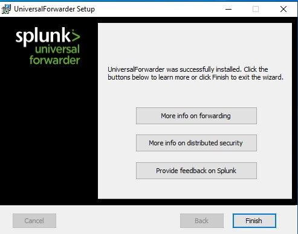

# Splunk Universal Forwarder — Installation and Configuration

## Objective

Install and configure the Splunk Universal Forwarder (UF) on the Windows 10 endpoint so that Sysmon telemetry generated locally is shipped to the Splunk Enterprise SIEM for centralized indexing, search, and future detection/alerting.

## Why a Universal Forwarder

The Splunk Universal Forwarder is a lightweight agent designed specifically to collect and forward data, with no indexing or search capability of its own — keeping its resource footprint on the monitored endpoint minimal. This mirrors how real enterprise environments collect telemetry: lightweight agents on every endpoint, forwarding to a smaller number of centralized indexers/SIEM instances rather than running full SIEM functionality on every machine.

---

## Installation

The Universal Forwarder installer (Windows x64) was downloaded directly onto the Windows 10 endpoint and installed using its setup wizard.


*Figure 1 — Splunk Universal Forwarder setup wizard confirming successful installation on the Windows 10 endpoint.*

During setup, the forwarder was configured with the deployment server and receiving indexer pointing at the Splunk Enterprise host:

| Setting | Value |
|---|---|
| Receiving Indexer | 192.168.13.1 |
| Receiving Port | 9997 |

---

## Connectivity Verification

After installation, Splunk's own internal logs (`index=_internal sourcetype=splunkd`) were searched on the **Splunk Enterprise side** to confirm the forwarder had successfully connected:

```spl
index=_internal sourcetype=splunkd
```


*Figure 2 — Splunk internal log search showing the Windows 10 endpoint (`host = WIN10-SOC-ENDPOINT`) successfully connecting to the indexer: `Connected to idx=192.168.13.1:9997:0, pset=0, reuse=0, autoBatch=1`. This confirms the Universal Forwarder established a working TCP output connection to the Splunk Enterprise receiver.*

This confirmed the forwarder-to-indexer connection was active and stable before configuring which specific log channel to forward. That configuration is documented in [inputs.conf Configuration](inputs-conf-config.md).
