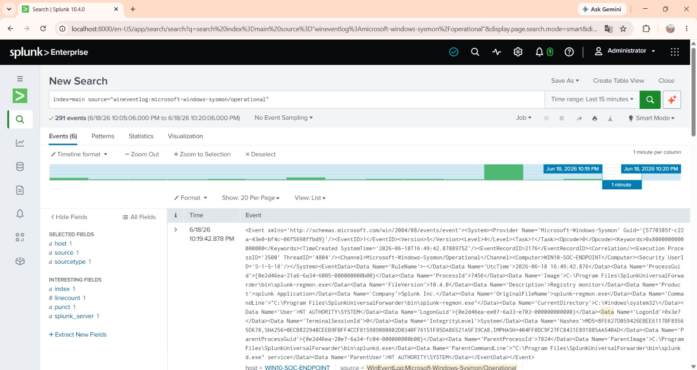
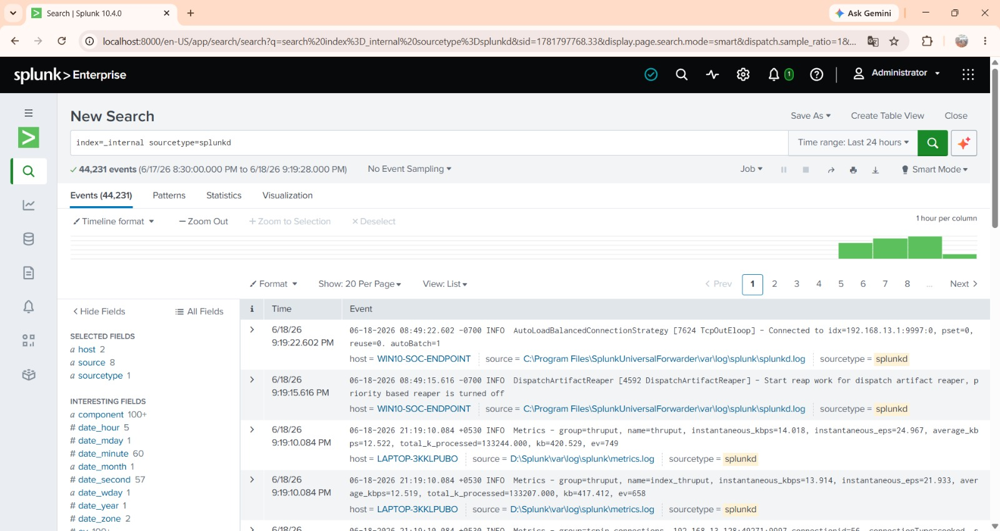

# Log Verification — Confirming Sysmon Telemetry in Splunk

## Objective

Validate, on the Splunk Enterprise side, that Sysmon telemetry generated on the Windows 10 endpoint is being successfully received, indexed, and made searchable — completing the end-to-end SOC telemetry pipeline.

## Verification Search

With the Universal Forwarder connected ([Universal Forwarder Installation](../07-log-forwarding/uf-installation.md)) and `inputs.conf` scoped to the Sysmon Operational channel ([inputs.conf Configuration](../07-log-forwarding/inputs-conf-config.md)), the following search was run in Splunk to confirm events were arriving:

```spl
index=main source="WinEventLog:Microsoft-Windows-Sysmon/Operational"
```

### Result

The search returned indexed events from the Windows 10 endpoint, confirming the full pipeline — Sysmon → Universal Forwarder → TCP 9997 → Splunk indexing — was functioning correctly.


*Figure 1 — Splunk search results showing a raw Sysmon Event ID 1 (Process Creation) event successfully indexed from the Windows 10 endpoint. The event's `host` field shows `WIN10-SOC-ENDPOINT`, and the `source` field correctly shows `WinEventLog:Microsoft-Windows-Sysmon/Operational`, confirming the inputs.conf scoping worked as intended.*

The raw event data visible in this search includes:

| Field | Example Value | Significance |
|---|---|---|
| `EventID` | 1 | Sysmon Process Creation event |
| `Computer` | WIN10-SOC-ENDPOINT | Confirms source endpoint |
| `Image` | `C:\Program Files\SplunkUniversalForwarder\bin\splunk-regmon.exe` | Full process path captured |
| `CommandLine` | `"C:\Program Files\SplunkUniversalForwarder\bin\splunk-regmon.exe" "Registry monitor"` | Full command-line arguments captured — critical for detecting suspicious execution patterns |
| `User` | NT AUTHORITY\SYSTEM | User context of the process |
| `ParentImage` | `splunkd.exe` | Parent process, enabling process-tree reconstruction |
| `Hashes` | MD5 / SHA256 / IMPHASH | File hash data for threat intel correlation |

This level of field-rich detail is exactly what makes Sysmon Event ID 1 the backbone of most endpoint detection logic — the same fields (`Image`, `CommandLine`, `ParentImage`, `User`, `Hashes`) are what real-world detections for living-off-the-land binaries (LOLBins), suspicious parent/child process relationships, and known-malicious hash matches are built on.

---

## Forwarder Connection Confirmation

In addition to the Sysmon event search above, Splunk's internal logs were also queried to confirm the forwarder maintained a stable connection over time:

```spl
index=_internal sourcetype=splunkd
```


*Figure 2 — Splunk internal logs confirming a persistent connection from `WIN10-SOC-ENDPOINT` to the indexer at `192.168.13.1:9997`.*

A dedicated visualization of event volume and variety — for example, a `stats count by EventID` search over the Sysmon sourcetype, showing the full range of Event IDs reaching the index rather than a single Event ID 1 sample — is planned as an addition to this section. See [Future Improvements](../13-future-improvements/roadmap.md) for tracking.

---

## Result

End-to-end log ingestion was successfully validated. The Windows 10 endpoint's Sysmon telemetry — specifically Event ID 1 (Process Creation) — is confirmed flowing through the Universal Forwarder, across the VMware Host-Only network, into the Splunk Enterprise indexer, and is fully searchable.

This completes the core SOC telemetry pipeline build-out. The next phase of this project is **detection engineering**: writing Splunk searches and correlation rules against this telemetry, mapped to MITRE ATT&CK techniques. See [Detection Use Cases](../09-detection-usecases/detection-use-cases.md).
