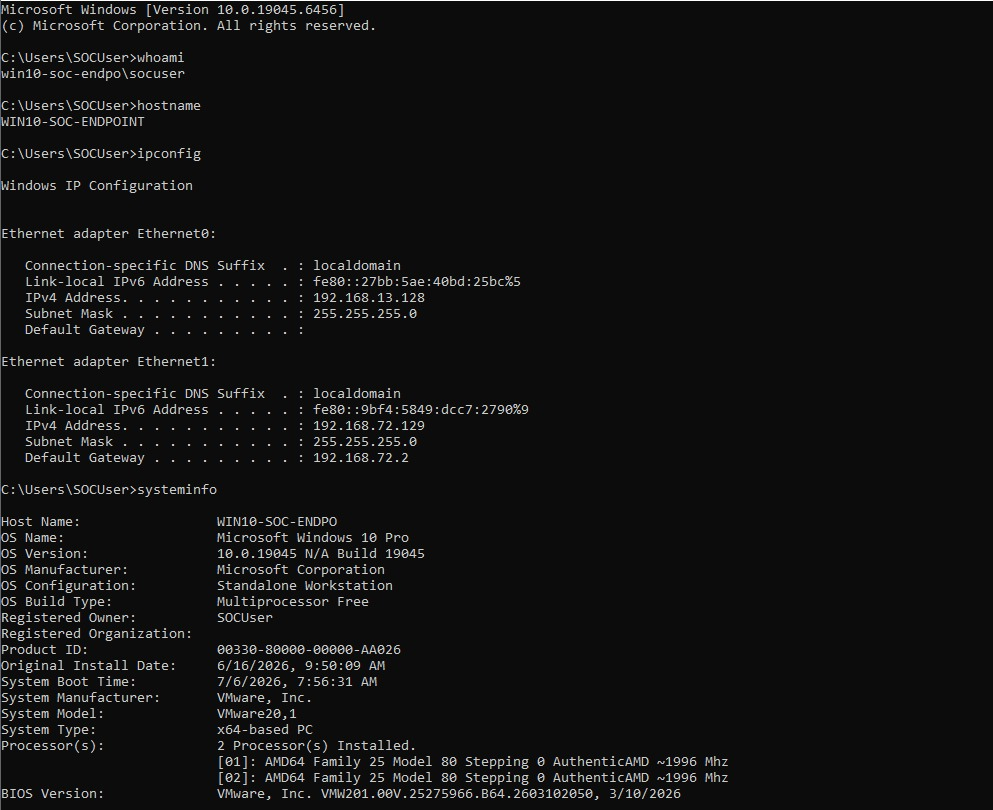

# Attack Execution

| Previous | Current | Next |
|----------|---------|------|
| [← Attack Scenario](attack-scenario.md) | **Attack Execution** | [Telemetry Analysis →](../investigation/telemetry-analysis.md) |

---

> [!NOTE]
>
> **Document:** Attack Execution
>
> **Investigation Phase:** 2 of 10
>
> **Detection ID:** DET-002
>
> **MITRE ATT&CK:** T1059.003 – Windows Command Shell
>
> **Status:** ✅ Completed

---

# Attack Overview

Following the reconnaissance scenario defined in the previous phase, an interactive Command Prompt (`cmd.exe`) session was used to execute a sequence of native Windows commands. The objective was to simulate an attacker gathering information about the compromised endpoint using built-in operating system utilities.

Each command was executed manually to generate endpoint telemetry that could later be validated using Sysmon and investigated within Splunk Enterprise.

---

# Attack Prerequisites

The following components were operational before beginning the simulation:

| Component | Status |
|-----------|--------|
| Windows 10 Endpoint | ✅ Running |
| Sysmon Installed | ✅ |
| Splunk Universal Forwarder | ✅ Running |
| Splunk Enterprise | ✅ Running |
| Telemetry Pipeline | ✅ Verified |

---

# Commands Executed

The following commands were executed sequentially from an interactive Command Prompt session.

```cmd
whoami
hostname
ipconfig
systeminfo
net user
tasklist
```

---

# Purpose of Each Command

| Command | Purpose |
|----------|---------|
| `whoami` | Identify the current user context. |
| `hostname` | Determine the computer name. |
| `ipconfig` | Enumerate network configuration. |
| `systeminfo` | Gather operating system and hardware information. |
| `net user` | Enumerate local user accounts. |
| `tasklist` | Identify running processes. |

---

# Expected Outcome

The execution of these commands was expected to generate Sysmon Event ID 1 (Process Create) events for each process created.

These events would then be forwarded to Splunk Enterprise through the configured telemetry pipeline, allowing the activity to be investigated from the perspective of a SOC analyst.

---

# Evidence



**Figure 1.** Interactive Command Prompt session showing the execution of native Windows reconnaissance commands.

---

# Execution Observations

The simulated reconnaissance activity completed successfully without generating any execution errors.

Each command executed as expected and produced observable process creation activity on the Windows endpoint. This establishes the foundation for the next phase of the investigation, where endpoint telemetry is validated before proceeding to SIEM analysis.

> [!TIP]
> During incident investigations, the exact sequence of executed commands often provides valuable context. While each command may appear benign individually, executing several reconnaissance utilities in rapid succession can indicate post-compromise discovery activity.

---

# Execution Summary

The attack simulation successfully reproduced a common host reconnaissance sequence using legitimate Windows command-line utilities.

No third-party tools or malware were introduced during the simulation. Instead, the investigation focused on demonstrating how legitimate administrative utilities can be abused during the reconnaissance phase of an intrusion while still producing high-value telemetry for defenders.

---

## Next Step

➡ Continue to **[Telemetry Analysis](../investigation/telemetry-analysis.md)** to verify that Sysmon successfully captured the executed activity.