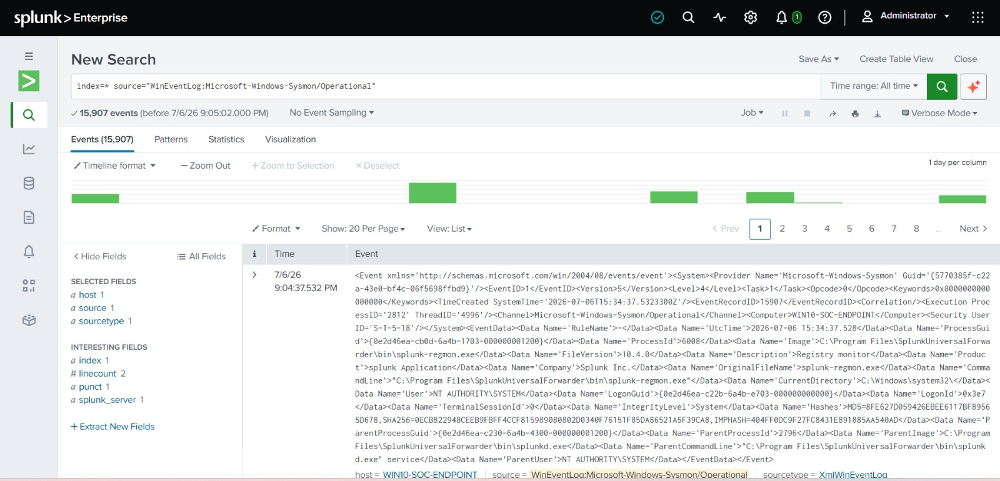
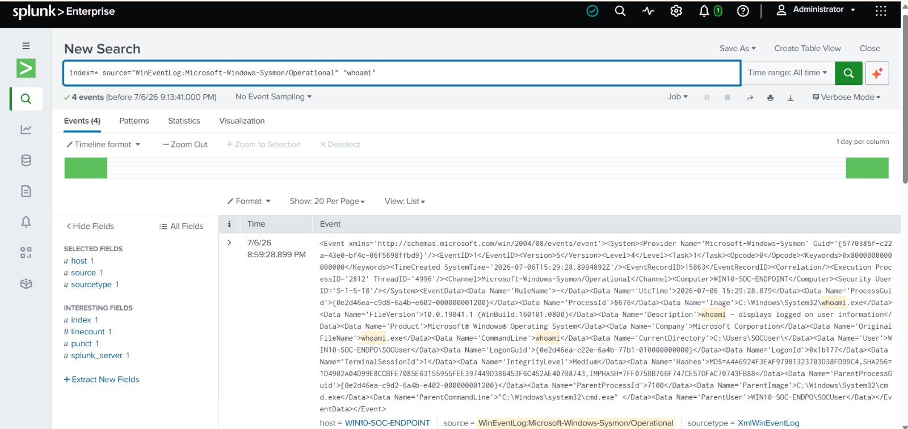
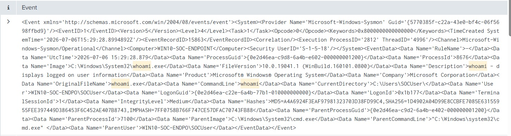

# Splunk Investigation

| Previous | Current | Next |
|----------|---------|------|
| [← Telemetry Analysis](telemetry-analysis.md) | **Splunk Investigation** | [Analyst Findings →](analyst-findings.md) |

---

> [!NOTE]
>
> **Document:** Splunk Investigation
>
> **Investigation Phase:** 4 of 10
>
> **Detection ID:** DET-002
>
> **MITRE ATT&CK:** T1059.003 – Windows Command Shell
>
> **Platform:** Splunk Enterprise 10.4.0
>
> **Status:** ✅ Completed

---

# Investigation Objective

After confirming that Sysmon successfully generated endpoint telemetry, the investigation transitioned to Splunk Enterprise to validate that the events were successfully ingested through the telemetry pipeline.

The objective of this phase was to identify the simulated reconnaissance activity within the SIEM, verify end-to-end telemetry visibility, and reconstruct the attack using the available event data.

> [!TIP]
>
> Effective investigations begin with broad searches before progressively narrowing the scope. This approach reduces the risk of overlooking relevant telemetry and provides better situational awareness.

---

# Initial Investigation

The investigation began by confirming that Sysmon Operational events were present within Splunk.

The following search was executed to retrieve all available Sysmon Process Create events.

```spl
index=main source="XmlWinEventLog:Microsoft-Windows-Sysmon/Operational"
```




**Figure 3.** Sysmon Operational events successfully ingested into Splunk Enterprise.

The returned events confirmed that the telemetry pipeline was functioning correctly and that Sysmon Process Create events were successfully available for investigation.

---

# Narrowing the Investigation

Once telemetry availability was confirmed, the investigation focused on identifying one of the executed reconnaissance commands.

The following query was used to locate executions of the `whoami` command.

```spl
index=main source="XmlWinEventLog:Microsoft-Windows-Sysmon/Operational"
"whoami"
```




**Figure 4.** Search results identifying the execution of `whoami.exe`.

The query successfully isolated the relevant Process Create event, allowing detailed inspection of the associated telemetry.

---

# Event Inspection

After locating the relevant event, the raw XML data was examined to verify the recorded process details.

The event contained detailed telemetry describing the executed process, including the executable path, command line, parent process, execution context, integrity level, and unique process identifiers.




**Figure 5.** Raw Sysmon XML event inspected during the investigation.

Rather than relying solely on extracted fields, the investigation validated the original XML event to ensure the recorded telemetry accurately represented the executed activity.

> [!IMPORTANT]
>
> At the time of this investigation, automatic Sysmon XML field extraction had been intentionally deferred to prioritize continued portfolio development. XML string matching was therefore used as the primary investigation technique. This decision does not affect the integrity of the collected telemetry.

---

# Investigation Summary

The Splunk investigation successfully confirmed that the simulated reconnaissance activity was visible within the SIEM.

Beginning with a broad search and progressively narrowing the investigation enabled efficient identification of the executed commands while preserving investigative context.

The collected telemetry provides sufficient evidence to reconstruct the attack sequence and supports further behavorial analysis.

---

## Next Step

➡ Continue to **[Analyst Findings](analyst-findings.md)**.