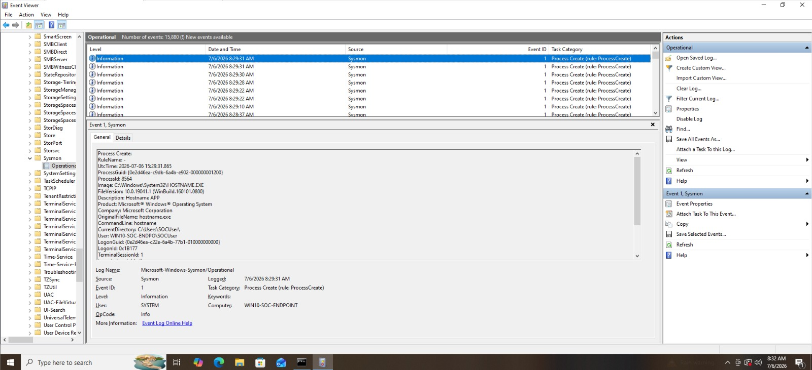

# Telemetry Analysis

| Previous | Current | Next |
|----------|---------|------|
| [← Attack Execution](../attack/attack-execution.md) | **Telemetry Analysis** | [Splunk Investigation →](splunk-investigation.md) |

---

> [!NOTE]
>
> **Document:** Telemetry Analysis
>
> **Investigation Phase:** 3 of 10
>
> **Detection ID:** DET-002
>
> **MITRE ATT&CK:** T1059.003 – Windows Command Shell
>
> **Primary Data Source:** Sysmon Event ID 1 – Process Create
>
> **Status:** ✅ Completed

---

# Telemetry Overview

Following the successful execution of the reconnaissance commands, the next step was to verify that endpoint telemetry was generated correctly.

Microsoft Sysmon was configured to monitor process creation events on the Windows endpoint. Each executed command generated a corresponding **Sysmon Event ID 1 (Process Create)** event, providing detailed forensic information about the process execution.

Successful telemetry generation at the endpoint is a critical prerequisite before any investigation can be performed within the SIEM.

---

# Telemetry Source

| Component | Details |
|----------|---------|
| Telemetry Provider | Microsoft Sysmon |
| Event ID | 1 |
| Event Name | Process Create |
| Log Location | Microsoft-Windows-Sysmon/Operational |

---

# Why Event ID 1 Matters

Sysmon Event ID 1 records every newly created process on the endpoint and provides valuable contextual information beyond what is available through standard Windows event logs.

The event captures details that enable SOC analysts to reconstruct process execution, identify parent-child process relationships, determine the security context of the executing user, and correlate activity across multiple events during an investigation.

For this detection, Event ID 1 served as the primary telemetry source for validating that each reconnaissance command executed successfully.

---

# Captured Telemetry

The generated Process Create events contained several important fields used throughout the investigation.

| Telemetry Field | Investigation Value |
|----------------|---------------------|
| Image | Executable that was launched |
| CommandLine | Exact command executed |
| ParentImage | Parent process responsible for execution |
| ParentCommandLine | Command line of the parent process |
| User | Security context of the executing process |
| ProcessGuid | Unique identifier for process correlation |
| ParentProcessGuid | Enables reconstruction of the process tree |
| IntegrityLevel | Privilege level of the executing process |
| CurrentDirectory | Working directory of the process |
| Hashes | Cryptographic hashes of the executable |

---

# Telemetry Validation

Each reconnaissance command executed during the simulation generated a corresponding Sysmon Event ID 1 entry within the Sysmon Operational log.

The observed telemetry confirmed that endpoint monitoring was functioning correctly and that the configured Sysmon rules successfully captured the simulated attacker activity.

**Figure 2.** Sysmon Event ID 1 capturing the execution of one of the reconnaissance commands.

---
# Process Relationship

One of the most valuable aspects of Sysmon Event ID 1 is its ability to record process lineage.

During the investigation, the executed reconnaissance command was observed as a child process of **cmd.exe**, which itself was launched from the Windows desktop environment.

Understanding parent-child process relationships enables analysts to reconstruct execution chains and identify suspicious behavior that may not be apparent when evaluating individual processes in isolation.

> [!TIP]
> Parent-child process relationships are one of the most valuable sources of investigative context during endpoint investigations. They often reveal how a process was launched and whether its execution aligns with expected user behavior.

---

# Telemetry Summary

The endpoint successfully generated detailed process creation telemetry for every command executed during the simulation.

The collected telemetry contained sufficient contextual information to support process reconstruction, user attribution, and subsequent investigation within Splunk Enterprise.

With endpoint telemetry successfully validated, the investigation proceeds to confirm successful ingestion into the SIEM and perform log analysis.

---

## Next Step

➡ Continue to **[Splunk Investigation](splunk-investigation.md)**.